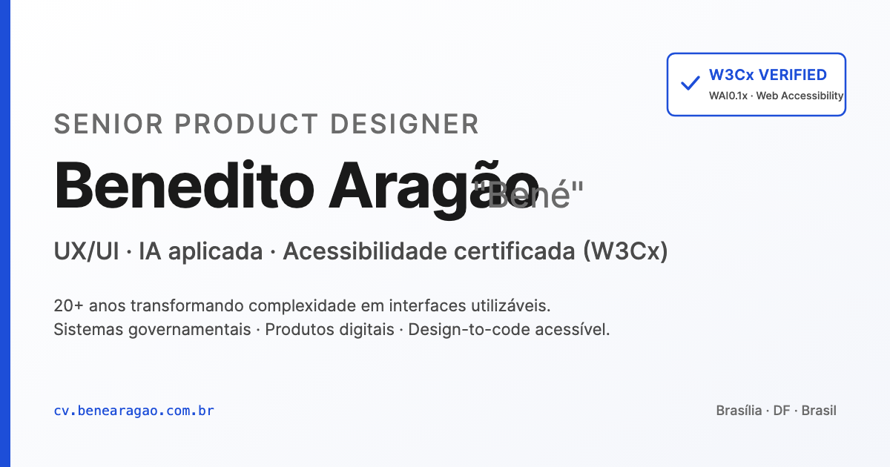

# Currículo digital · Bené Aragão

> CV web em **HTML5 + CSS3 puro**, com **acessibilidade WCAG 2.2 AA auditável**, deploy automático via FTP e zero dependências em runtime.

**🌐 Em produção:** <https://benearagao.com.br>
**📄 Open-source:** este repositório é o código-fonte completo, livre para fork.



---

## Por que esse repo existe

Construí esse CV para **três coisas ao mesmo tempo**:

1. **Substituir o PDF** por uma versão web que carrega em <1s, indexa no Google, vira PDF impecável no `Cmd+P` e nunca fica desatualizada.
2. **Comprovar — não declarar — domínio de fundamentos**: HTML semântico, ARIA, CSS sem framework, performance, SEO técnico e acessibilidade auditada por ferramenta (Lighthouse · axe DevTools · Playwright).
3. **Servir de referência aberta** para outras pessoas — designers, devs, profissionais em transição — que queiram abandonar templates genéricos e ter o próprio CV como peça de portfólio.

Se você é alguém procurando emprego e quer um CV que **diga e prove** o que você sabe fazer, esse repo é seu ponto de partida.

---

## Stack

| Camada | Tecnologia | Por quê |
|---|---|---|
| Markup | HTML5 semântico + Schema.org Person (JSON-LD) | SEO, leitor de tela, rich snippets |
| Estilo | CSS3 puro · tokens em `:root` · grid/flex · `@media print` | Zero build, sobrevive a qualquer mudança de stack |
| A11y | WCAG 2.2 AA · ARIA · `prefers-reduced-motion` · `forced-colors` | Auditado, não declarado |
| Hosting | Apache na Locaweb · `.htaccess` (gzip, cache 1 ano, HSTS) | Barato, estável, suficiente |
| CI/CD | GitHub Actions → FTP automático | Push em `main` = site no ar |
| Testes | Playwright (navegação por teclado) · axe-core | Verificável, não opinião |

---

## Estrutura do repositório

```
.
├── bene-cv/                    # O site (tudo dentro vai para o servidor)
│   ├── index.html              # CV completo, semântico, com JSON-LD
│   ├── styles.css              # Tokens + layout + print + a11y queries
│   ├── .htaccess               # Cache, gzip, security headers
│   ├── robots.txt              # Crawlers
│   ├── sitemap.xml             # Sitemap
│   ├── ACCESSIBILITY.md        # ⭐ Checklist WCAG 2.2 AA auditável
│   ├── README.md               # Guia técnico do site
│   └── assets/                 # favicon, foto, og-image
├── .github/workflows/
│   └── deploy.yml              # FTP deploy em push para main
├── tests/                      # Playwright (não vai para produção)
│   └── keyboard.spec.js        # Testes WCAG 2.4.x e 2.1.x automatizados
└── README.md                   # Este arquivo
```

---

## Use esse repo como template para o seu CV

1. **Fork** este repositório (botão "Fork" no topo do GitHub).
2. **Clone** para sua máquina:
   ```bash
   git clone https://github.com/SEU_USUARIO/curriculo-SEU_NOME-projeto.git
   cd curriculo-SEU_NOME-projeto
   ```
3. **Edite seu conteúdo** em `bene-cv/`:
   - `index.html` — troque nome, headline, experiências, projetos, contato. Atualize também os metadados (`<title>`, `og:*`, `twitter:*`, JSON-LD).
   - `styles.css` — se quiser, ajuste tokens em `:root` (cor accent, fontes, espaçamentos).
   - `assets/profile.jpg` — sua foto (120×120px, otimizada).
   - `assets/favicon.svg` — seu favicon.
   - `assets/og-image.png` — sua imagem de preview social (1200×630).
4. **Rode local** para conferir:
   ```bash
   cd bene-cv && python3 -m http.server 4321
   # Abra http://localhost:4321
   ```
5. **Configure o deploy** (escolha um):
   - **GitHub Pages** (grátis): Settings → Pages → Source: `main` / `bene-cv`. Funciona sem mexer no workflow.
   - **Netlify / Vercel / Cloudflare Pages** (grátis): conecte o repo, build command vazio, publish directory: `bene-cv`.
   - **FTP** (caso queira manter como aqui): edite `.github/workflows/deploy.yml` com seu servidor e configure os secrets `FTP_USERNAME` e `FTP_PASSWORD` em **Settings → Secrets and variables → Actions**.
6. **Push para main** e seu CV está no ar.

---

## Acessibilidade auditável

A acessibilidade aqui não é claim, é evidência. Cada critério WCAG 2.2 AA atendido está mapeado para o trecho de código que o satisfaz em **[`bene-cv/ACCESSIBILITY.md`](./bene-cv/ACCESSIBILITY.md)**.

Como auditar você mesmo:

```bash
# 1. Lighthouse (Chrome DevTools → Lighthouse → Accessibility)
#    Meta: 100/100

# 2. axe DevTools (extensão) → 0 violações

# 3. Testes automatizados de teclado (Playwright)
cd tests
npm install
npm run test:keyboard
```

Testes manuais: navegação só por teclado (skip link no primeiro `Tab`), VoiceOver/NVDA, `prefers-reduced-motion` ativo, `forced-colors: active` (High Contrast Mode do Windows).

---

## Decisões de design

Resumo das decisões — explicação completa em [`bene-cv/README.md`](./bene-cv/README.md).

| Decisão | Por quê |
|---|---|
| **Zero build, zero framework** | Coerência com o pitch de fundamentos. Deploy é cópia de arquivos. Sobrevive a qualquer mudança de stack. |
| **Accent `#0F766E` (teal)** | Contraste 5.50:1 sobre `#FFF` — AA texto normal. `theme-color` alinhado. |
| **Inter + JetBrains Mono** | Inter para corpo (legibilidade web). Mono para badges/códigos. OpenType features ativadas (kern, liga, tabular-nums). |
| **Skills via `<dl>`, sem barras** | Honesto e acessível. Barras de "85% de Figma" são teatro. |
| **`prefers-reduced-motion` + `forced-colors`** | Não é decoração — é WCAG 2.3.3 + suporte ao High Contrast do Windows. |

---

## Performance

- **Lighthouse-ready** — meta de 100/100 em Performance, Accessibility, Best Practices e SEO. Validação atual em andamento; rode você mesmo via Chrome DevTools → Lighthouse e me avise se encontrar algo abaixo do esperado.
- **Carrega em <1s** em conexão 3G via gzip + cache de 1 ano (configurado no `.htaccess`).
- **Cache busting** via query string `?v=YYYYMMDD` em `styles.css` quando há mudança.

---

## Inspiração e crédito

- **Construção / IA:** desenvolvido com auxílio do [Claude Code](https://claude.com/claude-code) (Anthropic) — pair-programming AI-augmented desde 2024.
- **Sem template comprado**, sem WordPress, sem builder. Cada linha foi decidida.
- Se esse projeto te inspirou, **dê uma ⭐** e me avisa nas issues — adoro ver forks.

---

## License

MIT — veja [`LICENSE`](./LICENSE). Você pode usar, modificar e distribuir livremente, inclusive em projetos comerciais. Só não esqueça de **substituir o conteúdo** pelo seu (nome, fotos, experiência) — copiar identidade não é fork, é fraude. 😉

---

> Feito em Brasília, DF · Por Bené Aragão · Disponível para conversa: <bene@benearagao.com.br>
